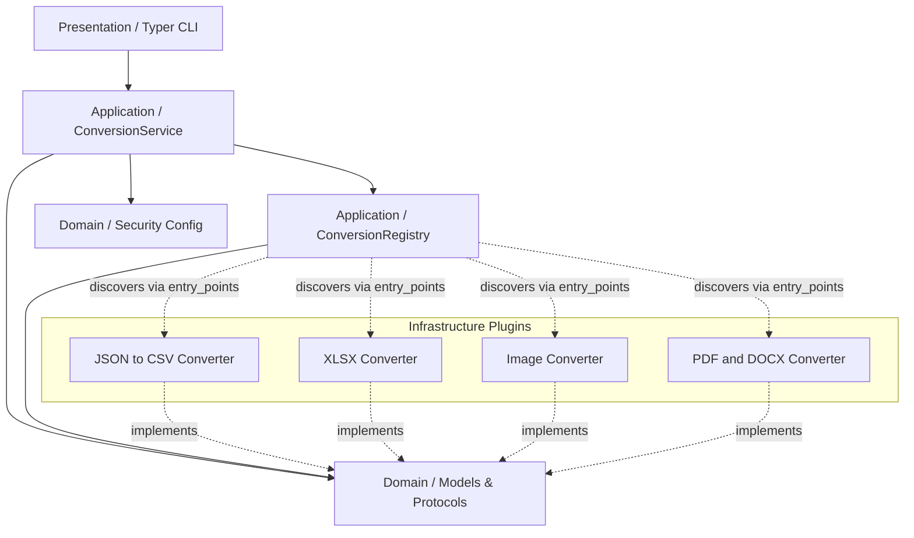

<div align="center">
  
  <h1>Python File Converter (PFC)</h1>
  <p><strong>A modular, secure, and blazing fast file conversion CLI driven by Clean Architecture.</strong></p>

  <p>
    <a href="https://github.com/Javi-CD/pfc/actions"></a>
    <a href="https://github.com/Javi-CD/pfc/blob/main/LICENSE"></a>
    <a href="https://www.python.org/downloads/"></a>
  </p>
</div>

<hr/>

## Table of Contents

- [About](#-about)
- [Architecture](#-architecture)
- [Features](#-features)
- [Installation](#-installation)
- [Usage](#-usage)
- [Security](#-security)
- [Community & Contribution](#-community--contribution)

---

## About

**PFC (Python File Converter)** es una herramienta de línea de comandos (CLI) diseñada para hacerte la vida más fácil a la hora de convertir archivos. Ya sea que necesites pasar un reporte de Excel a CSV, convertir imágenes, o extraer el texto de un PDF, PFC centraliza todo en un solo lugar.

Su enfoque principal es la **extensibilidad y la simplicidad**. Detrás de escena, está construido de manera modular para que cualquier desarrollador pueda añadir nuevos formatos de conversión (plugins) de forma rápida y sin tener que tocar el código central de la aplicación. Es una herramienta pensada tanto para el usuario final que busca conversiones rápidas en la terminal, como para el desarrollador que busca un sistema sólido sobre el cual construir.

## Architecture

PFC embraces **Clean Architecture** and SOLID principles to achieve maximum maintainability.



*For deeper insights, read our [Architecture Guide](docs/architecture.md).*

---

## Features

- **Blazing Fast CLI**: Powered by `Typer` and `Rich` for beautiful terminal output.
- **Dynamic Plugin System**: Uses Python's `entry_points` (`importlib.metadata`) to discover and load new converters completely dynamically. Check out the [Plugins Guide](docs/plugins.md).
- **Enterprise-grade Security**: Built-in protections against MIME-spoofing and OS path traversal.
- **Standalone Executable**: Pre-compiled with `PyInstaller` for zero-dependency execution on target machines.

---

## Installation

### Option 1: Standalone Executable (No Python Required)

1. Download the latest `pfc.exe` from the Releases tab.
2. Run it directly in your terminal:

   ```cmd
   .\pfc.exe --help
   ```

### Option 2: Using UV / Pip

```bash
# Clone the project
git clone https://github.com/Javi-CD/pfc.git

# Navigate to the project directory
cd pfc

# Install dependencies
uv sync

# Run the project
uv run pfc --help
```

---

## Usage

View all formats supported:

```bash
pfc list-formats


Convert a single file:

```bash
pfc convert data.csv --to json
```

Convert a file overwriting the destination if it exists:

```bash
pfc convert report.docx --to pdf --overwrite
```

Convert all supported files in a directory:

```bash
pfc batch data/ --to json
```

View all loaded plugins (converters):

```bash
pfc plugins
```

View information about a specific file:

```bash
pfc info image.jpg
```

---

## Security

PFC includes built-in defenses against malicious inputs

- **Magic Byte Validation**: Uses `filetype` to ensure extensions match real binary signatures.
- **Path Traversal Protection**: Rejects file writes to protected system directories.
- **Memory Safety**: Aborts conversion of files exceeding memory capacity (default 100MB).

Please refer to [SECURITY.md](SECURITY.md) for vulnerability reporting.

---

## Community & Contribution

We welcome contributions of all shapes and sizes!

- Read our [Contributing Guidelines](CONTRIBUTING.md) to get started.
- Please adhere to our [Code of Conduct](CODE_OF_CONDUCT.md).
- Want to write a new converter? Follow our [Plugin Development Guide](docs/plugins.md).
